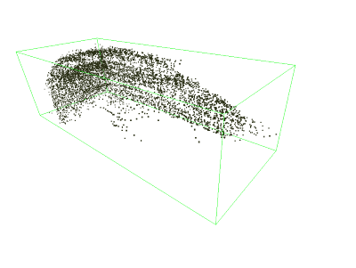
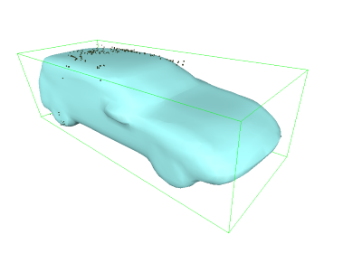
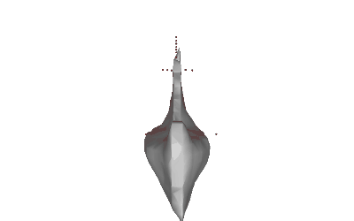
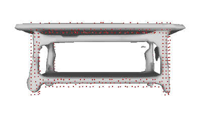
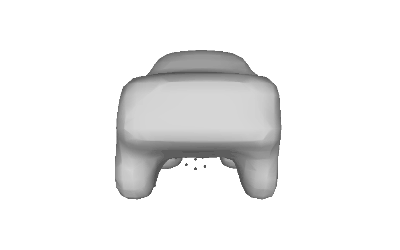

# Learning 3d Shape Completion under Self-Supervison
This repository contains source code of my master thesis: Learning 3D Shape Completion under Self-Supervision. The goal of this project is to complete 3D shape from partial input(i.e., 3D point cloud). We build a generative framework based on encoder-decoder network to learn a shared latent shape space that can be used to generate complete and realistic 3D shapes from partial and sparse inputs.





## Dataset

The datasets that are used:

1. [ShapeNet](https://www.shapenet.org/)
2. [KITTI-360](http://www.cvlibs.net/datasets/kitti-360/)
3. [Completion3D](https://completion3d.stanford.edu/)

## Usage

To configure the parameters:
```
cd configs/default.yaml
```

To train the model:
```
python train.py
```
To generate meshes from the trained model:
```
python generate.py
```

To evaluate the trained model:
```
python eval.py
```

## Package
- `im2mesh`: evaluation tool from [occupancy networks](https://github.com/autonomousvision/occupancy_networks)

## Demo




